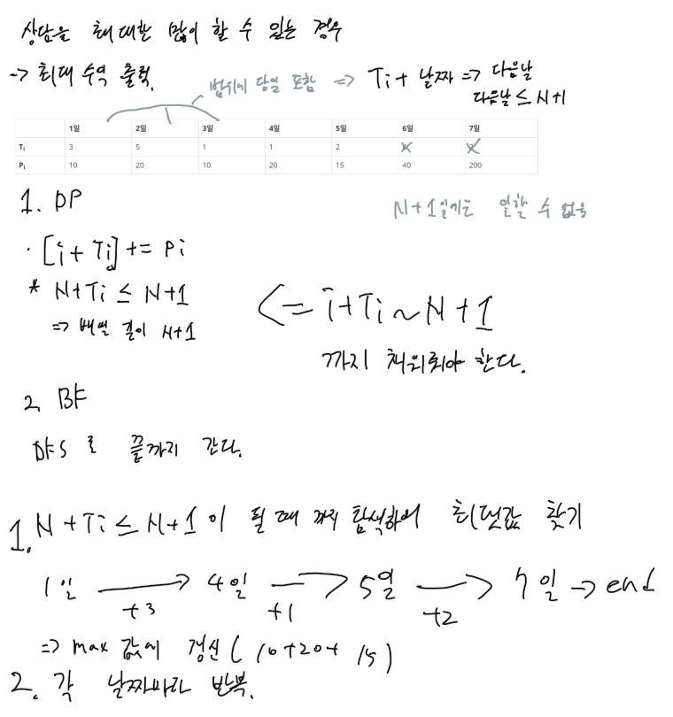

# [퇴사](https://www.acmicpc.net/problem/14501)

## 요구사항

상담을 최대한 많이 할 수 있는 경우의 수익(최대 수익) 출력

## 제한사항

첫째 줄에 N (1 ≤ N ≤ 15)이 주어진다.

둘째 줄부터 N개의 줄에 Ti와 Pi가 공백으로 구분되어서 주어지며, 1일부터 N일까지 순서대로 주어진다. (1 ≤ Ti ≤ 5, 1 ≤ Pi ≤ 1,000)

## 기타

